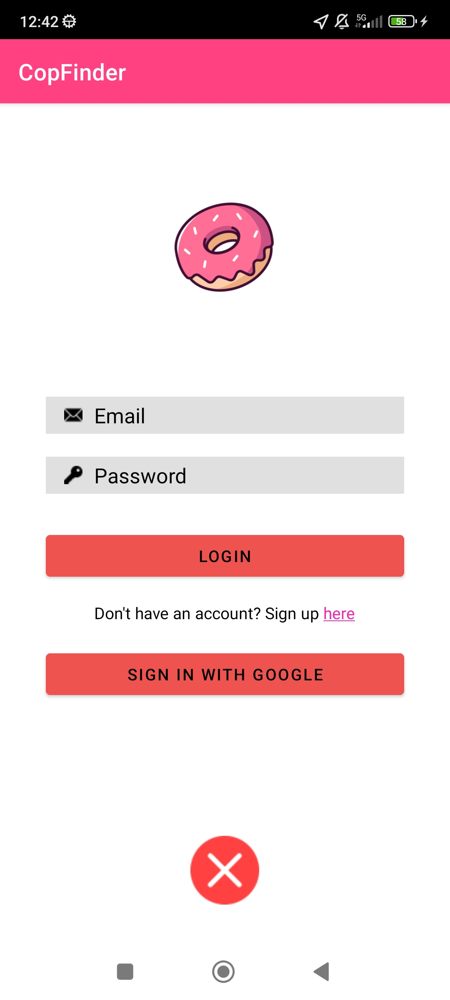

# CopFinder
## Workspace

Github:
  - Repository: https://github.com/OhhTuRnz/MAD_2024
  - Releases: https://github.com/OhhTuRnz/MAD_2024/releases

Workspace: https://upm365.sharepoint.com/sites/Logopedas/SitePages/Tracking.aspx

## Description
Welcome to **CopFinder**, a mobile application designed with real-time location tracking. Our app shows the nearest donuts shops around you as you move, along with some information about them. You can save your favorites shops and your favorites donuts and see them whenever you want.

## Screenshots and navigation

Here are some snapshots of CopFinder in action:

<table>
  <tr>
    <td>
      
    </td>
    <td>
      
    </td>
  </tr>
  <tr>
    <td style="text-align:center;">
      CopFinder Main Menu. The nearest shops appear here,  you can select them as your favorites. You can also access the settings, the map and the recent visited shops from here.
    </td>
    <td style="text-align:center;">
      CopFinder Drawer Menu. The main difference from the main menu is that you can access the login (or register), your personal data and the logout.
    </td>
  </tr>
  <tr>
    <td>
      
    </td>
    <td>
      
    </td>
  </tr>
  <tr>
    <td style="text-align:center;">
      CopFinder Login. The first step is to create your own account,  you can do it pressing the word sign up here. Then you will  be able to login with the mail you used or with Google  thanks to Firebase. 
    </td>
    <td style="text-align:center;">
      CopFinder Recent Visited Shops. The shops that you visit on our map can be seen in this section.
    </td>
  </tr>
  <tr>
    <td>
      
    </td>
    <td>
      
    </td>
  </tr>
  <tr>
    <td style="text-align:center;">
      CopFinder Map. This is the main event of our app.   Here you can see your location and the shops markers.  If you press on one of them, it will display a message,  if you click on More, you can submit your valoration  and a comment, if you press on Go, your mobile will open  Google Maps and the location of the shop.
    </td>
    <td style="text-align:center;">
      CopFinder Donuts List. You can see a list with lots of donuts. Select the ones you like more.
    </td>
  </tr>
  <tr>
    <td>
      
    </td>
    <td>
      
    </td>
  </tr>
  <tr>
    <td style="text-align:center;">
      CopFinder Clusters
    </td>
    <td style="text-align:center;">
      CopFinder Profile
    </td>
  </tr>
  <tr>
    <td>
      
    </td>

  </tr>
  <tr>
    <td style="text-align:center;">
      CopFinder Dark mode
    
  </tr>
</table>

## Demo Video

## Features
Functional features:

- **Shop tracker:** Search for the nearest donut shops.
- **Interactive Map:** View marks and routes directly on the interactive map.
- **Real-Time Location Tracking:** Navigate our map with ease as our app tracks your location in real-time.
- **User-Friendly Interface:** Our app is designed for all ages, with a focus on ease of use.

Technical features:
- Persistence in shared preferences.
- Persistence in Room database.
- Cache.
- Firebase Realtime database.
- Firebase authentication.
- Maps: Openstreetmaps, with zoom function.
- Menu: BottomMenu, DrawerMenu, TabMenu.
- Implemented images with Glide.
- Security with location permissions.
- Sensors: GPS coordinates.
- Dark mode.
- API ()
- Recent shops visited
- Ratting system and comments
- Access to Google Maps

## How to Use

When you enter the app, the shops near you will appear, you can press the button next to it to open the map, and it will show you your location and where the shop is. You can sign up opening the drawer menu, pressing login and sign up, enter your credentials and you will be ready to access to new functions. You can logout and sign in with your google account or with an email. These new functions are the favorite shops and favorite donuts. You can access these two in the homepage, on the bottom menu. If you press the heart button in one of the shops near you, it will appear in the favorite shops function. If you enter the favorite donuts function, you will be able to select which donuts you like most.
## Additional section

## Participants

List of MAD developers:
- ALEJANDRO CARRASCO ARAGON (alejandro.carrasco.aragon@alumnos.upm.es)
- ALVARO TAJUELO GOMEZ (alvaro.tgomez@alumnos.upm.es)

Join us and sweeten your life with CopFinder!
